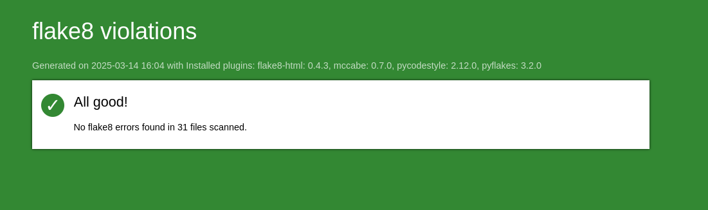

# Project_09_OC
django app


```bash
sudo apt-get install sqlite3
```

Pré-requis

    Avoir Python et pip installé sur sa machine.

    Cloner le repo

git clone https://github.com/Razvan-drb/Project_08_OC

    Créer l'environnement virtuel

python -m venv env

    Activer l'environnement virtuel

source env/bin/activate

    Installer les packages requis

```bash
pip install -r requirements.txt
```

    Lancer le serveur Django

```bash
python manage.py runserver
```

    Dans le navigateur de votre choix, se rendre à l'adresse affiché dans le terminal

Django administration

→ http://127.0.0.1:8000/admin/

Fonctionnalités

    Se connecter et s'inscrire ;
    Modifier son mot de passe ;
    Consulter un flux contenant les tickets et critiques des utilisateurs auxquels on est abonné ;
    Créer des tickets de demande de critique ;
    Créer des critiques, en réponse ou non à des tickets ;
    Voir ses propres posts, les modifier ou les supprimer ;
    Suivre d'autres utilisateurs, ou se désabonner.

Générer un rapport flake8-html

flake8 --ignore=E501 --format=html --htmldir=flake-report


